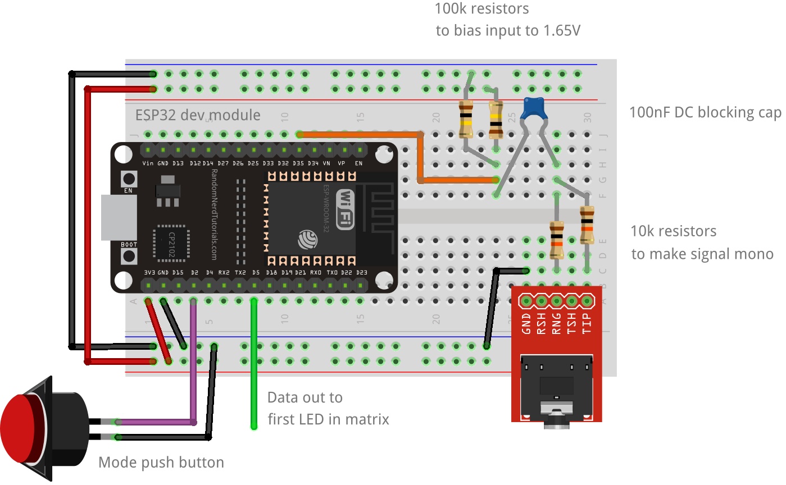
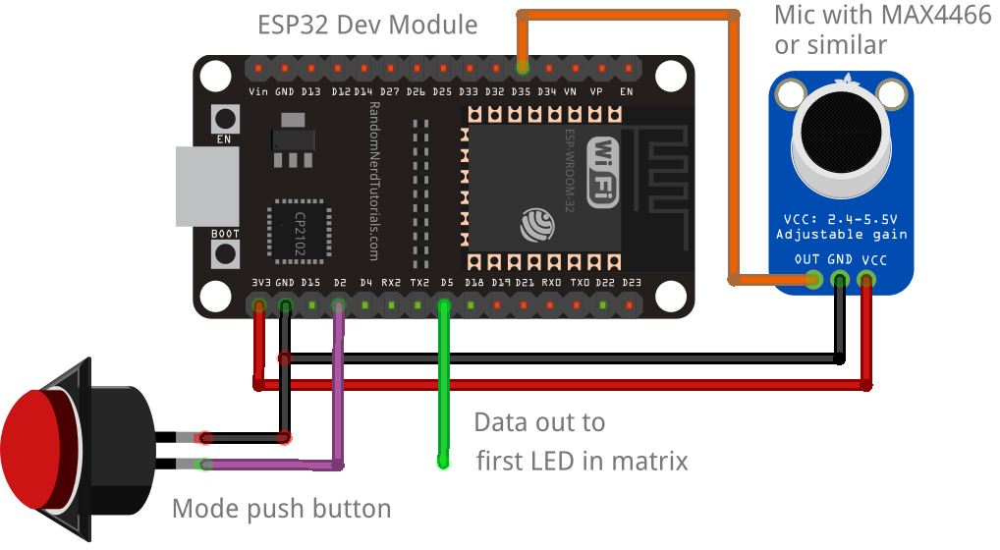

# ESP32_FFT_VU
A spectrum analyzer VU meter running a 40kHz FFT on an ESP32 and outputting to a 16 x 16 FastLED matrix. The code is heavily modified from [this example](https://github.com/G6EJD/ESP32-8266-Audio-Spectrum-Display/blob/master/ESP32_Spectrum_Display_02.ino) originally written by G6EJD who has a very useful [YouTube channel](https://www.youtube.com/user/G6EJD/videos), so check him out.

## Demo
If you are planning on using this code, it is advisable to watch the YouTube video below explaining how it works. Please note, the code has changed to use FastLED Neomatrix since the video was produced thanks to [VonHirsch](https://github.com/VonHirsch/). See 'Installation and code usage' below.

## Setting up the circuit
The matrix will run from both a line input or microphone, so choose whichever setup works for you. When choosing the pin for your button, be careful. Some pins on the ESP32 don't have pullup resistors, and if you choose one of these the button won't work! When I was testing, I found that D2 didn't work, but D4 did so I went with that one.

### Line in

The incoming stereo signal is first converted to mono using two 10K resistors, then through a 100nF capacitor to block DC. The signal is then biased by two 100k resistors to 3.3V / 2 = 1.65V to be read by the ADC. None of these values are critical. The resistors should be 10k or above and each pair should match. I've tried capacitors from 100nF to 10uF and haven't noticed any difference in the results. Pin D5 is the LED data pin and is connected to the first LED in the matrix. Pin D2 is connected to a momentary push button which is used to change display modes.

### Microphone

This is much simpler than the line in method, but you will be limited to the frequencies that you can detect by the sensititivy of the microphone. You need a mic with on-board amplification, commonly something like the MAX4466 which can be bought cheaply from eBay or alixepress. You would get better results with an I2S microphone, but that is beyond the scope of this project. Turn up the gain on whatever microphone you have. The mic should be connected to GND, 3V3 and the output pin to D35. Pin D5 is the LED data pin and is connected to the first LED in the matrix. Pin D2 is connected to a momentary push button which is used to change display modes.

## Installation and code usage
1. Download this repository and open ESP32_FFT_VU.ino.
2. You will need the FastLED Neomatrix and EasyButton libraries from the Arduino library manager. Youw will also need the arduinoFFT library. At the time of writing, the library manager version arduinoFFT has a bug which prevents `DCRemoval()` from working, so download it from the [GitHub repository](https://github.com/kosme/arduinoFFT) and install it from a zip file.
3. Watch the video to see how to use it.
4. To customsise it to your own matrix layout, read about Neomatrix layouts at [Adafruit](https://learn.adafruit.com/adafruit-neopixel-uberguide/neomatrix-library#layouts-2894555-5).

## Controls
The matrix is controlled from a single button. The functions are:
- Single press: Change pattern
- Long press: Change brightness
- 3 button presses in 2 seconds: Set to auto-change pattern
- 5 button presses in 2 seconds: Turn off display
